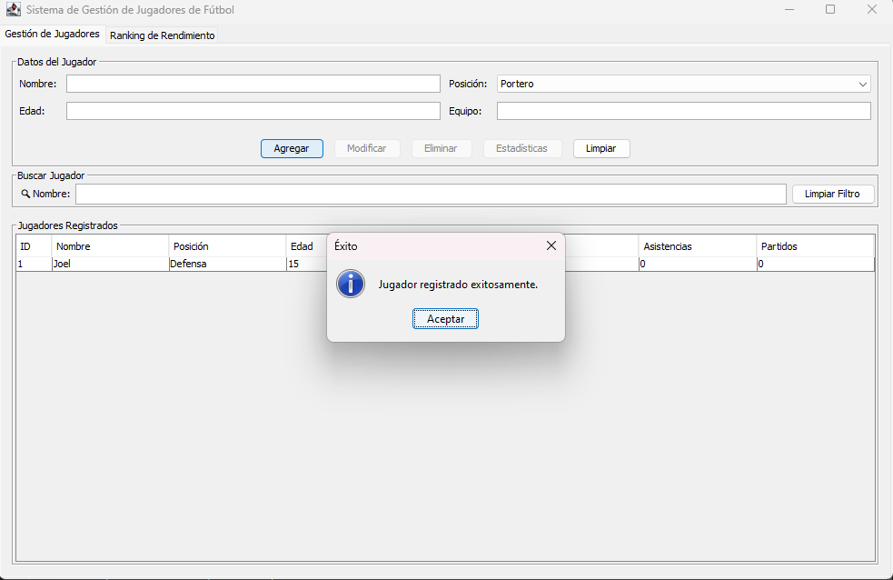
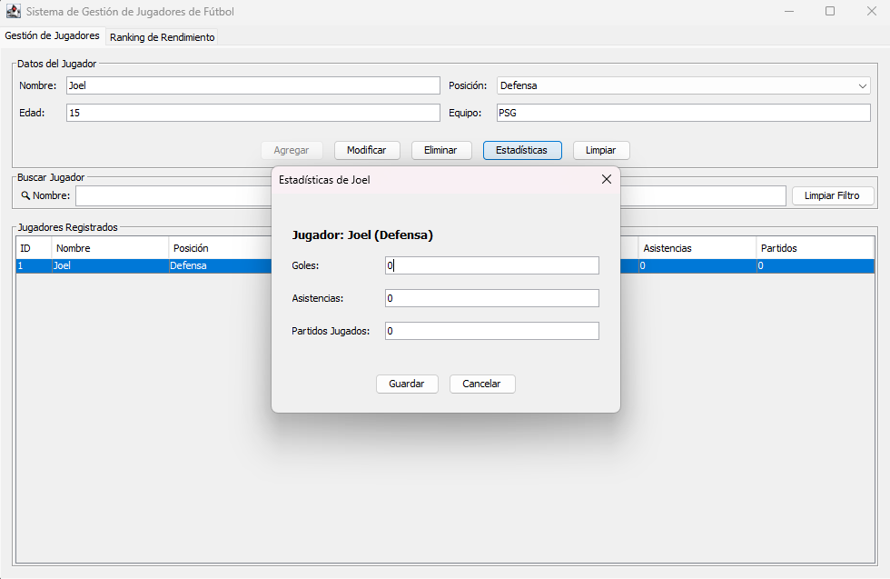
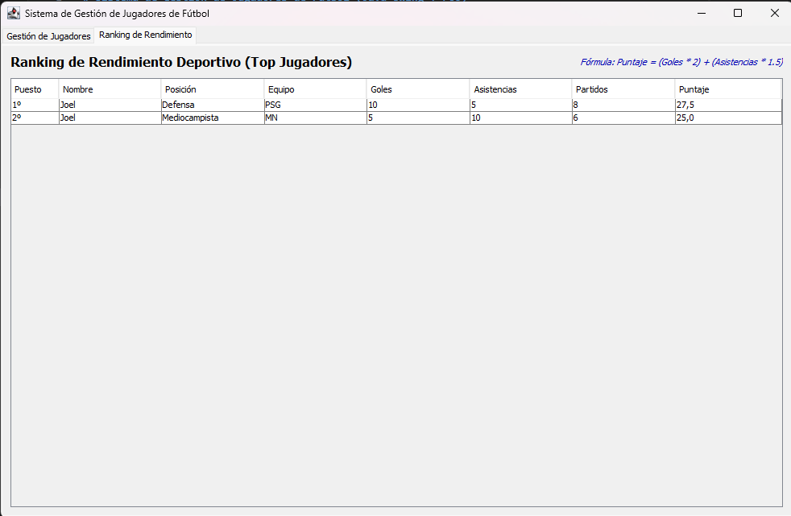

# Sistema de Gestión de Jugadores de Fútbol (Java Swing + POO)

Aplicación de escritorio desarrollada en Java con interfaz gráfica Swing para la administración integral de futbolistas y su rendimiento deportivo. El proyecto implementa los principios de la Programación Orientada a Objetos (POO) y una arquitectura en capas.

---

## Requisitos del Sistema
* **Java Development Kit (JDK):** Versión 17 o superior.
* **Sistema Operativo:** Windows, macOS o Linux.
* **Herramientas de Terminal:** Terminal estándar o PowerShell con comandos de Java configurados en la variable de entorno PATH.

---

## Estructura del Proyecto
El proyecto está organizado en una arquitectura de capas limpia directamente bajo la carpeta de código fuente `src`:

```
src/
├── Main.java              # Punto de entrada de la aplicación (Look & Feel e inicio EDT)
├── model/                 # Entidades y enumeradores del dominio
│   ├── Jugador.java       # Representa al futbolista (composición con Estadistica)
│   ├── Estadistica.java   # Estadísticas individuales (goles, asistencias, partidos)
│   └── Posicion.java      # Enum de posiciones en cancha (Portero, Defensa, Mediocampista, Delantero)
├── service/               # Lógica de negocio (Contrato e Implementación en memoria)
│   ├── IJugadorService.java
│   └── JugadorService.java
├── ui/                    # Capa de interfaz gráfica (Swing)
│   └── VentanaPrincipal.java # Ventana con JTabbedPane, CRUD, Buscador y Rankings
└── util/                  # Helpers y utilidades técnicas
    └── Validador.java     # Lógica centralizada de validación
```

---

## Instrucciones de Compilación y Ejecución
Para ejecutar el proyecto de manera independiente a través de la terminal, sitúate en la raíz del proyecto (`SistemaJugadores/`) y ejecuta los siguientes comandos:

### 1. Compilación
Compila todos los archivos fuente de Java guardando los archivos binarios compilados `.class` en una carpeta llamada `out`:
```powershell
# En Windows (PowerShell/CMD):
javac -d out -encoding UTF-8 src/model/*.java src/service/*.java src/util/*.java src/ui/*.java src/Main.java
```

### 2. Ejecución
Inicia la aplicación utilizando el classpath de la carpeta `out`:
```powershell
# Ejecutar la aplicación:
java -cp out Main
```

---

## Capturas de Pantalla del Proyecto
### 1. Gestión de Jugadores y CRUD
Visualización principal de la gestión, creación de jugadores y buscador en tiempo real.



### 2. Registro de Estadísticas Deportivas
Subpantalla modal interactiva para ingresar goles, asistencias y partidos de forma independiente.



### 3. Ranking de Rendimiento y Reportes
Pestaña de análisis con el ranking actualizado en tiempo real según el puntaje obtenido.



---

## Funcionamiento del Sistema

### 1. Módulo CRUD Completo
* Permite **Agregar** nuevos jugadores con ID incremental autogenerado automáticamente por la capa de servicio.
* Muestra el listado de jugadores en un **JTable** de manera dinámica.
* Permite la **Modificación** seleccionando la fila correspondiente en la tabla, lo cual carga los datos actuales en el formulario.
* Implementa la **Eliminación** con una confirmación visual previa por medio de un diálogo emergente de confirmación.

### 2. Sistema de Validación Inteligente
* Valida campos vacíos en datos obligatorios (Nombre y Equipo).
* Valida tipos de datos y restringe la edad a valores enteros positivos entre **1 y 60 años**.
* Valida las estadísticas deportivas para que no acepten valores negativos o formatos alfabéticos incorrectos.
* Resalta visualmente los campos con errores en **borde rojo** y reporta todos los fallos acumulados en una lista.

### 3. Buscador en Tiempo Real
* Campo de búsqueda insensible a mayúsculas/minúsculas.
* Utiliza una búsqueda por coincidencia parcial (método `contains`).
* Filtra las filas de la tabla de forma instantánea al escribir y cuenta con un botón para limpiar el filtro.

### 4. Algoritmo de Rendimiento y Ranking
La aplicación calcula un puntaje para cada futbolista a partir de la siguiente fórmula ponderada:
$$\text{Puntaje} = (\text{Goles} \times 2.0) + (\text{Asistencias} \times 1.5)$$

* **Criterio de Desempate:** En caso de empate de puntajes, el sistema sitúa arriba al futbolista con **menos partidos jugados** (mayor eficiencia). Si la igualdad persiste, se ordena alfabéticamente por su nombre.

---

## Limitaciones del MVP (Minimum Viable Product)
Dado que es una entrega del MVP, el sistema cuenta con las siguientes restricciones de alcance:
* **Persistencia Temporal:** Toda la información se almacena en memoria (`HashMap` y `ArrayList`). Cerrar la aplicación provocará el reinicio completo de los datos.
* **Sin Base de Datos o Archivos:** No se hace uso de bases de datos relacionales, JDBC, ni almacenamiento en archivos serializables/planos.
* **Gestión Individual:** No se implementa administración de torneos, campeonatos, ni perfiles de equipos de manera colectiva.
* **Sin Autenticación:** El ingreso al sistema es directo, sin perfiles de administrador ni contraseñas.
